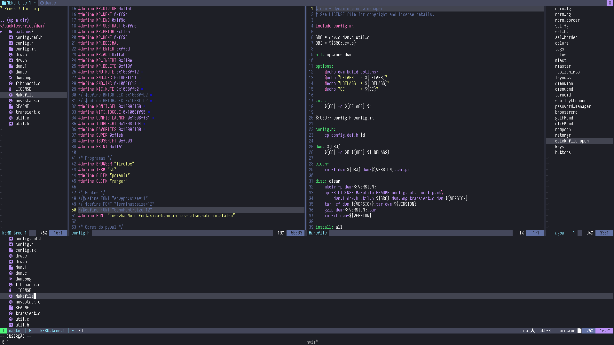

# Suckless Rice

A simple rice using software from [suckless.org](https://suckless.org://suckless.org/):

* [dwm](https://dwm.suckless.org/) window manager;
* [dwmstatus](https://dwm.suckless.org/status_monitor/) DIY status monitor for dwm bar;
* [dmenu](https://tools.suckless.org/dmenu/) as a program runner. Also used in various other scripts;
* [st](https://st.suckless.org/) terminal emulator;
* [slock](https://tools.suckless.org/slock/) screen locker;
* [surf](https://surf.suckless.org/) as a quick search web browser;

